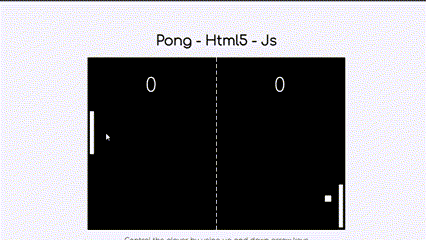

[⬅ Go Back](https://github.com/JpMunhozOliveira)

  
   
  
 
  

# Description 📜

This is a simple Pong game created in Unity. Pong is one of the most classic and iconic video games in gaming history 🕹️. Originally released in 1972 by Atari, the game consists of a virtual ping-pong match where players control paddles and try to hit a ball back and forth across the opponent's field 🏓.

The game is considered one of the first commercially successful electronic games in history and helped popularize the electronic gaming industry as a whole 💰.

Despite its simplicity, Pong is a challenging game that requires quick reflexes and skill to control the paddle 👾. Additionally, the game can be played against both the computer and another player, making it a fun multiplayer option 🎮.

## Preview 🔍

  

